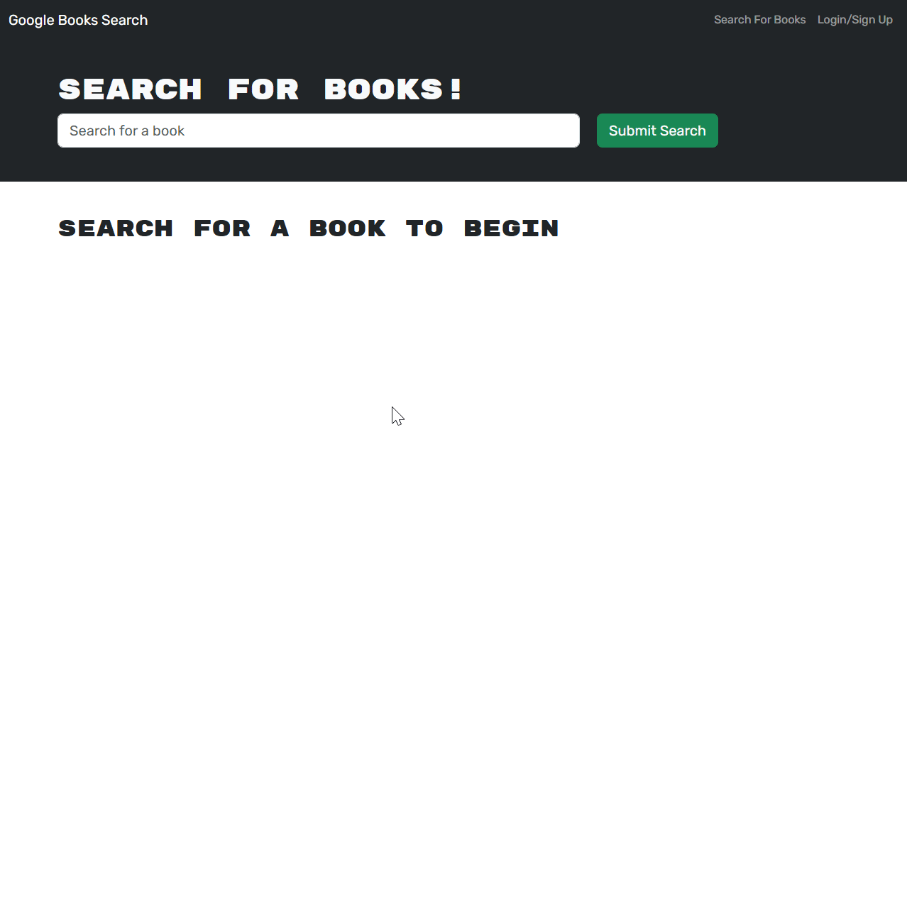

# Book Search Engine


## Description
The **Book Search Engine** is a fully functional web application that allows users to search for books and manage a personal reading list. This project refactors the original RESTful API code to use GraphQL, which streamlines data handling and improves the efficiency of user interactions. Users can search for books using the Google Books API and save their favorites for easy access later. Authentication is implemented with JSON Web Tokens (JWT), enabling users to sign in or sign up securely and access the site without repeated logins within a session period.

## Table of Contents
- [Installation](#installation)
- [Usage](#usage)
- [License](#license)
- [Features](#features)
- [Tests](#tests)
- [Questions](#questions)

## Installation
To set up the project locally, install GraphQL along with the necessary dependencies, as the application is being refactored from a RESTful API to a GraphQL architecture.

```bash
# Clone the repository
git clone https://github.com/durfey32/book-search-engine.git

# Install dependencies
npm install
After installing dependencies, refactor the endpoints to use GraphQL, and configure JWT for secure authentication.
```

## Usage
- **Sign In or Sign Up:** Start by creating an account or logging in to access the search features.
- **Search for Books:** Use the search bar to find books through the Google Books API.
- **Save Books:** Add books to your saved book list to keep track of your favorites.
- **View & Manage Saved Books:** Access your saved book list, view details, and remove books from the list as needed.

## License
This project is licensed under the MIT License.

## Features
- **User Authentication:** Secure sign-in and sign-up with JWT.
- **Book Search:** Search for books via the Google Books API.
- **Personal Reading List:** Save books to a list, view them, and delete them as desired.

## Tests
For live testing and to experience the full functionality, visit the hosted website [here](https://book-search-engine-sciz.onrender.com).

## Example



## Questions?
For any questions or further information, feel free to reach out:

- **GitHub:** [durfey32](https://github.com/durfey32)
- **Email:** [durfey_32@yahoo.com](mailto:durfey_32@yahoo.com)

Please don't hesitate to contact me for any inquiries!